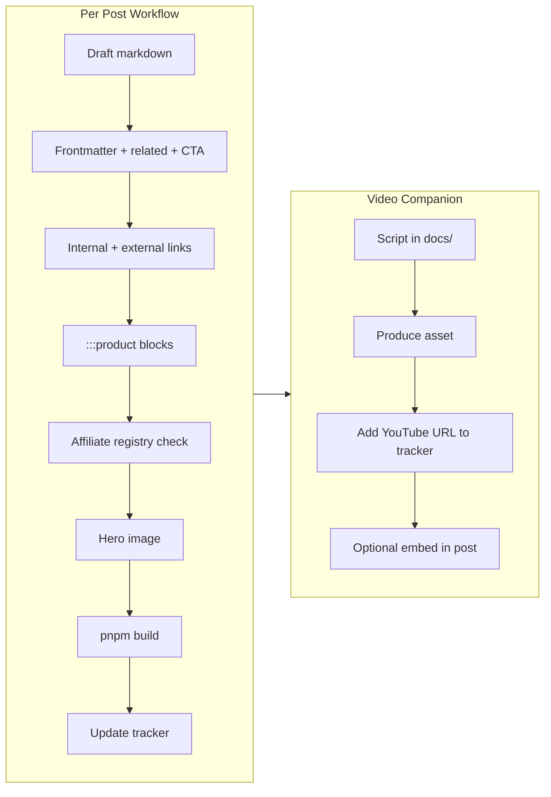

# EarthNest Systems Series — 10 Blogs + 10 Infographic Videos

## Summary

Deploy a second **Regenerative Living (EarthNest)** content arc: ten 1,000+ word markdown posts and ten matching infographic-video scripts. Each post follows the established `content/blog/*.md` pipeline (frontmatter, `<!-- blog-cta -->` at ~500 words, internal links, external authority anchors, `:::product` affiliate blocks). Videos are documented and published separately; blogs link to them once URLs exist. Work ships **one post at a time** on user command (“Start Blog N”) to preserve quality and avoid cannibalizing existing Pillar 3 URLs.

---

## Problem Frame

Pillar 3 already has five published posts (closed-loop food, rainwater, staged solar, growing zones, legacy small-space food). The new series deepens **systems thinking**—container shells, low-waste plumbing, compost engines, solar sizing, food forests, and a Florida reality capstone—bridging high-performance design with regional code and climate. The homepage and conversion paths (Starter Kit, Rainwater PDF, Zones Tool, Calculator, Qualify) are built; this plan scales content without breaking SEO or duplicating thin variants of existing slugs.

---

## Requirements

- R1. Each blog: **≥1,000 words**, markdown in `content/blog/{slug}.md`, no H1 in body, no `---` dividers in body.
- R2. Mid-post CTA via `<!-- blog-cta -->` placed near the **500-word** mark; `cta` and `endCta` frontmatter aligned to post intent.
- R3. Internal links to **Tiny Home Communities** (`/tiny-home-communities/florida`), **Growing Zones Tool** (`/florida-growing-zones-homestead-planning`), **ADU Calculator** (`/adu-calculator`), **ADU Rules** (`/adu-rules`), and **2–4 related posts** via `related:` frontmatter.
- R4. External authority links where topically required (USDA PHZM, Florida Building Code, ARCSA, DOH greywater guidance, etc.).
- R5. Affiliate products via `:::product` blocks; URLs must exist in `lib/affiliate-links.ts` (extend from `docs/affiliate-product-master-list.md` first).
- R6. Update `docs/blog-content-tracker.md` and verify `pnpm run build` after each post.
- R7. Ten video scripts stored in repo with 1:1 blog mapping; optional YouTube embed added to matching post when published.
- R8. Avoid keyword cannibalization with existing Pillar 3 slugs—differentiate angle or consolidate (see Overlap Matrix).

---

## Scope Boundaries

- Does not migrate `small-space-food-florida-backyard` TSX (separate queued task).
- Does not produce finished video assets—scripts, metadata, and publish hooks only.
- Does not add new blog pillars or CTA variants unless a post truly needs one (prefer existing six variants in `lib/blog/cta-types.ts`).
- Does not auto-generate all ten posts in one PR—sequential delivery on “Start Blog N”.

### Deferred to Follow-Up Work

- GA4 click events on `BlogInlineCta` / `BlogEndCta` (calculator already tracks `calculator_interaction`; blog CTAs do not yet).
- Dedicated `/blog/series/earthnest-systems` hub page (nice-to-have after 3+ posts ship).
- MrCool / Renogy / EcoFlow partner programs beyond Amazon placeholders.

---

## Context & Research

### Relevant Code and Patterns

| Asset | Path | Role |
|-------|------|------|
| Post storage | `content/blog/*.md` | Canonical body + frontmatter |
| Markdown renderer | `components/blog/markdown-body.tsx` | `<!-- blog-cta -->`, `:::product`, affiliate `rel="sponsored"` |
| CTA variants | `lib/blog/cta-types.ts` | `starter-kit`, `qualify`, `communities`, `rainwater-guide`, `calculator`, `zones-tool` |
| Inline/end CTA UI | `components/blog/blog-inline-cta.tsx` | Mid + end conversion blocks |
| Related reads | `lib/blog/related-posts.ts` | Honors `related:` array first |
| Affiliate registry | `lib/affiliate-links.ts` | Must contain hrefs used in `:::product` |
| Pillar taxonomy | `lib/blog/pillars.ts` | All ten posts → `pillar: regenerative` except Post 10 (see decision below) |
| Tracker | `docs/blog-content-tracker.md` | Living inventory |
| Sitemap | `app/sitemap.ts` | Auto-includes markdown slugs via `getAllPosts()` |
| Reference post | `content/blog/rainwater-harvesting-low-footprint-resilience.md` | Gold standard for structure, ARCSA links, products, lead magnet |

### Overlap Matrix (critical for SEO)

| # | Proposed slug | Existing overlap | Differentiation strategy |
|---|---------------|------------------|---------------------------|
| 01 | `what-is-regenerative-tiny-living` | Light touch on closed-loop | **Series hub**—define EarthNest framework; link forward to posts 02–10 |
| 02 | `tiny-home-self-sufficiency-decentralized-utilities` | Staged resilience (efficiency) | Lifestyle + utility independence; link to staged-resilience as prerequisite |
| 03 | `core-systems-low-waste-tiny-home` | Closed-loop kitchen scraps | **Systems plumbing**—graywater, mass flow, waste streams; link to closed-loop for food loop |
| 04 | `container-home-living-system-thermal-envelope` | None direct | Container + continuous insulation + vapor control; Florida humidity tie-in |
| 05 | `backyard-homesteading-small-lots-florida` | Growing zones, small-space food | **Zone 0–2 mapping** on tight lots; heavy zones-tool CTA |
| 06 | `composting-every-sustainable-home-plan` | Closed-loop mentions compost | Deep C:N, deep litter, thermophilic; product: compost tumbler / worm bin |
| 07 | `rainwater-collection-tiny-homes-first-steps` | **High** — `rainwater-harvesting-low-footprint-resilience` | Tiny-home / THOW / small roof angle; link existing post as “ADU deluge deep dive”; avoid duplicating 600-gallon math—summarize + link |
| 08 | `solar-battery-basics-tiny-home-living` | **Medium** — `staged-resilience-efficiency-before-solar-panels` | LiFePO4 sizing, inverter, peak load; open with “efficiency first” link to staged-resilience |
| 09 | `food-forests-gardens-greenhouses-small-properties` | Growing zones, closed-loop, resilient roots | **Seven-layer food forest** framework; native perennials for FL |
| 10 | `florida-reality-check-zoning-hurricanes-humidity` | Legal pillar posts | **`pillar: legal`** (cross-series capstone) or `regenerative` with category `Florida · Code & climate`; link `/adu-rules`, Orange County accordions |

---

## Key Technical Decisions

- **Series ID:** `earthnest-systems-v2` in tracker (internal label only—not a new pillar enum).
- **Post 10 pillar:** Use `legal` for SEO alignment with zoning/hurricane queries; category string carries EarthNest framing (`Regenerative · Florida reality`).
- **Publish cadence:** One post per invocation; user trigger phrase: **“Start Blog N”** (N = 1–10).
- **Word-count CTA placement:** Insert `<!-- blog-cta -->` after the second major H2 block (~500 words)—verify in preview, not by blind char count.
- **Images:** One hero diagram per post under `public/images/blog/`; reuse infographic storyboard as static hero where video not yet live.
- **Videos:** Scripts in `docs/video-infographic-scripts/`; frontmatter field `videoSlug` optional later—use tracker table until embed component exists.

---

## Open Questions

### Resolved During Planning

- **Duplicate rainwater post?** Ship Post 07 as tiny-home-first primer; canonical deep ADU content stays on existing slug; cross-link both ways in `related:`.
- **Calculator on homepage?** Already moved to `/adu-calculator`; posts 02, 08, 10 should link there, not `/#adu-calculator`.

### Deferred to Implementation

- Final YouTube channel URL pattern and embed component design.
- Whether Post 10 gets a `qualify` endCta vs `starter-kit` (default: `qualify` for permitting friction).

---

## High-Level Technical Design

> *Directional guidance for review—not implementation specification.*



---

## Output Structure

```
content/blog/
  what-is-regenerative-tiny-living.md          # Post 01
  ...                                          # Posts 02–10

docs/
  blog-content-tracker.md                      # Updated each ship
  video-infographic-scripts/
    README.md
    01-container-shell-system-future.md
    ...                                        # Scripts 01–10

public/images/blog/
  {slug}-hero.png                              # One per post

lib/affiliate-links.ts                         # Extended as needed
```

---

## Implementation Units

### U1. Series infrastructure and tracker

**Goal:** Establish series metadata, slug registry, and video script folder before Post 01.

**Requirements:** R6, R7

**Dependencies:** None

**Files:**
- Create: `docs/video-infographic-scripts/README.md`
- Modify: `docs/blog-content-tracker.md` (add “Series: EarthNest Systems v2” queue table)

**Approach:**
- Add queued table with columns: #, slug, title, pillar, mid CTA, end CTA, video script file, status.
- README explains script format: hook (3s), beats (15–45s), on-screen text, CTA URL, companion blog slug.

**Verification:**
- Tracker lists all 10 posts as `queued`.
- Script filenames map 1:1 to video blueprint titles.

---

### U2. Affiliate and product gap fill

**Goal:** Pre-register products referenced in Posts 04, 06, 08 before those posts ship.

**Requirements:** R5

**Dependencies:** None (can run parallel to U1)

**Files:**
- Modify: `docs/affiliate-product-master-list.md` (MrCool DIY mini-split, LiFePO4 battery, portable solar, greywater kit placeholders)
- Modify: `lib/affiliate-links.ts`

**Approach:**
- Add categories: `hvac`, `solar`, `compost` (extend existing).
- Posts must only use registry hrefs—no raw Amazon URLs in markdown without registry entry.

**Verification:**
- Every planned `:::product` block in the production schedule has a matching registry id or documented “pending ASIN” note in master list.

---

### U3. Repeatable post production runbook (Posts 01–10)

**Goal:** Document the exact checklist executed on each “Start Blog N”.

**Requirements:** R1–R6

**Dependencies:** U1

**Files:**
- Create: each `content/blog/{slug}.md` on demand
- Modify: `docs/blog-content-tracker.md` per ship
- Optional: `public/images/blog/{slug}-hero.png`

**Approach — frontmatter template:**

```yaml
---
title: "{SEO title}"
description: "{150–160 char meta}"
date: "YYYY-MM-DD"
category: "Regenerative Living · {subtopic}"
readTime: "9 min read"
pillar: regenerative   # Post 10: legal
cta: starter-kit       # vary per schedule below
endCta: qualify        # vary per schedule below
leadMagnet: starter-kit  # optional: rainwater-guide on Post 07 only if extending magnet
related:
  - {slug-1}
  - {slug-2}
  - {slug-3}
---
```

**Per-post CTA schedule:**

| # | Mid `cta` | End `endCta` | Primary internal targets |
|---|-----------|--------------|---------------------------|
| 01 | starter-kit | qualify | `/`, closed-loop, staged-resilience |
| 02 | starter-kit | calculator | self-sufficiency → `/adu-calculator` |
| 03 | starter-kit | rainwater-guide | closed-loop, rainwater post |
| 04 | qualify | starter-kit | container → `/qualify`, `/adu-rules` |
| 05 | zones-tool | communities | zones tool, `/tiny-home-communities/florida` |
| 06 | starter-kit | zones-tool | closed-loop, growing zones |
| 07 | rainwater-guide | starter-kit | **link existing rainwater post**, ARCSA |
| 08 | calculator | starter-kit | staged-resilience, `/adu-calculator` |
| 09 | zones-tool | communities | growing zones, resilient-roots |
| 10 | qualify | calculator | `/adu-rules`, legal posts, `#orange-county-requirements` |

**Body rules:**
- Open with Florida/Central FL grounding paragraph + link to `/`.
- 4–6 H2 sections; bullets and numbered lists for scannability.
- 2–4 external authority links (see schedule table in Sources).
- 2–4 `:::product` blocks max; spaced across sections.
- Closing paragraph + implicit next step (no duplicate end CTA copy in body).

**Verification:**
- `pnpm run build` passes.
- Post appears on `/blog/category/regenerative`.
- Tracker row moves `queued` → `published`.

---

### U4. Post 01 — What Is Regenerative Tiny Living?

**Goal:** Ship series anchor post when user says “Start Blog 1”.

**Requirements:** R1–R6

**Dependencies:** U1, U3

**Files:**
- Create: `content/blog/what-is-regenerative-tiny-living.md`
- Create: `public/images/blog/what-is-regenerative-tiny-living.png` (optional)
- Create: `docs/video-infographic-scripts/01-container-shell-system-future.md`

**Keywords:** regenerative tiny living, EarthNest framework, closed-loop stewardship, architectural density.

**External anchors:** USDA sustainability resources; link Florida Building Code where mentioning permitted vs mobile structures.

**Verification:** ≥1,000 words; mid CTA present; `related` includes at least one existing Pillar 3 post.

---

### U5. Posts 02–05 — Self-sufficiency through homesteading

**Goal:** Ship posts 02–05 sequentially on user command.

**Dependencies:** U4 (01 published for forward links)

**Files:** Four markdown posts per slug table in Overlap Matrix.

**Sequencing note:** Post 04 (container envelope) pairs with Video 01 script; Post 05 pairs with Video 02 (food on small lots).

**Verification:** Each post cross-links Post 01 as series hub once 01 is live.

---

### U6. Posts 06–09 — Waste, water, energy, food systems

**Goal:** Ship posts 06–09 with strict overlap discipline (especially 07–08).

**Dependencies:** U5

**Critical checks:**
- Post 07: Opening paragraph links to `rainwater-harvesting-low-footprint-resilience` as authoritative ADU catchment doc.
- Post 08: Opening links to `staged-resilience-efficiency-before-solar-panels` before solar sizing content.

**Verification:** No duplicate meta descriptions vs existing rainwater/solar posts.

---

### U7. Post 10 — Florida Reality Check

**Goal:** Capstone bridging regenerative design and legal reality.

**Dependencies:** U6

**Files:**
- Create: `content/blog/florida-reality-check-zoning-hurricanes-humidity.md`
- Create: `docs/video-infographic-scripts/08-florida-humidity-changes-everything.md` (Video 8 pairs topically; Video 10 script for zero-waste can link from Post 03)

**Approach:**
- `pillar: legal`; category `Regenerative · Florida code & climate`.
- Link `/adu-rules`, `/blog/special-exception-orange-county-zoning`, homepage `#orange-county-requirements`.
- External: [Florida Building Code](https://floridabuilding.org/), wind-load / HVHZ references (cite FBC chapter, not amateur engineering claims).
- Hurricane + humidity section links Post 04 vapor envelope content.

**Verification:** Post indexed under `/blog/category/legal` and cross-linked from regenerative posts.

---

### U8. Video infographic script pack

**Goal:** Complete all ten scripts in repo for production handoff.

**Requirements:** R7

**Dependencies:** U1

**Files:**
- Create: `docs/video-infographic-scripts/01-container-shell-system-future.md` through `10-almost-zero-waste-pipeline.md`

**Script template (each file):**

```markdown
# {Title}
Companion blog: /blog/{slug}
Duration target: 60–90s
Platform: YouTube Short / Reels / LinkedIn

## Hook (0–3s)
## Beats (storyboard table: time | visual | voiceover | on-screen text)
## Core message (one sentence)
## CTA (URL + UTM: ?utm_source=youtube&utm_medium=video&utm_campaign=earthnest-v2)
## Assets needed (CAD, icons, b-roll)
```

**1:1 mapping:**

| Video # | Script file | Companion blog |
|---------|-------------|----------------|
| 1 | 01-container-shell-system-future | Post 04 |
| 2 | 02-tiny-home-grow-food | Post 05 |
| 3 | 03-rainwater-flow-system | Post 07 |
| 4 | 04-compost-waste-to-soil | Post 06 |
| 5 | 05-chickens-ducks-support-land | Post 06 or 05 (poultry subsection) |
| 6 | 06-solar-powers-tiny-home | Post 08 |
| 7 | 07-greywater-rules-planning | Post 03 |
| 8 | 08-florida-humidity-changes-everything | Post 10 |
| 9 | 09-food-forest-seven-layers | Post 09 |
| 10 | 10-almost-zero-waste-pipeline | Post 03 |

**Verification:** README index lists all ten with status `script_ready`.

---

### U9. Conversion tracking enhancement (optional)

**Goal:** GA4 events on blog CTA clicks for attribution.

**Requirements:** R6 (engagement)

**Dependencies:** U4 (at least one post live to test)

**Files:**
- Modify: `components/blog/blog-inline-cta.tsx`

**Approach:** `onClick` → `gtag('event', 'select_promotion', { promotion_name: variant, location: 'blog_mid' | 'blog_end' })`.

**Test expectation:** Manual verify in GA4 DebugView when clicking mid/end CTA on a published post.

**Verification:** Events fire without layout shift; affiliate disclosure remains bottom-only on blog pages.

---

## System-Wide Impact

- **SEO:** 10 new indexable URLs; sitemap grows automatically; category page `/blog/category/regenerative` gains 9 posts (Post 10 under legal).
- **Internal linking graph:** Series hub (Post 01) becomes high out-degree node; existing Pillar 3 posts gain backlinks— strengthens rather than cannibalizes if overlap matrix is followed.
- **Affiliate compliance:** Disclosure banner unchanged (bottom of `app/blog/[slug]/page.tsx`); new product blocks increase disclosure surface—monitor copy.
- **Unchanged:** Blog pillar enum, CTA variant set, markdown parser contract, navigation/footer links.

---

## Risks & Dependencies

| Risk | Mitigation |
|------|------------|
| Keyword cannibalization (rainwater, solar) | Overlap matrix + mandatory cross-links + distinct titles/meta |
| Thin affiliate links (placeholder ASINs) | U2 completes registry before product-heavy posts |
| Series fatigue on long homepage | No homepage change; discovery via `/blog`, search, related reads |
| Florida code claims in Post 10 | Cite official sources; link `/adu-rules`; disclaimer language matching Orange County section |
| Video production lag | Static hero images from storyboards; embed added later |

---

## Documentation / Operational Notes

- After each post: bump `docs/blog-content-tracker.md` published count and slug index.
- Social copy: extend `docs/social-pillar-posts.txt` or add `docs/social-earthnest-v2-posts.txt` when posts ship (optional, per post).
- User trigger for execution: **“Start Blog N”** invokes U3 checklist for post N.

---

## Sources & References

- Blog pipeline: `content/blog/rainwater-harvesting-low-footprint-resilience.md`
- Tracker: `docs/blog-content-tracker.md`
- Affiliate master: `docs/affiliate-product-master-list.md`
- External authorities: [USDA Plant Hardiness](https://planthardiness.ars.usda.gov/), [Florida Building Code](https://floridabuilding.org/), [ARCSA](https://www.arcsa.org/)
- User-provided production schedule (10 blogs + 10 videos, May 2026)

---

## Execution Order (recommended)

1. **U1 + U2** — infrastructure and affiliate prep (one session)
2. **U8** — video scripts (can parallelize with writing)
3. **U4 → U7** — posts 01–10 on demand via “Start Blog N”
4. **U9** — after Post 01 ships, if analytics attribution is priority

**Ready command:** Say **“Start Blog 1”** to begin Post 01 (`what-is-regenerative-tiny-living`).
