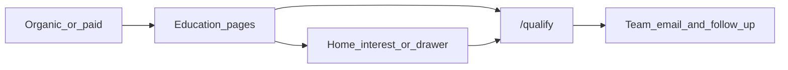

# Prefabricated.co — Site Audit & Handoff

**Purpose:** Single technical reference for what is built, where data lives, user flows, and team QA checklists.

**Production URL:** `https://www.prefabricated.co`  
**Stack:** Next.js 16 (App Router) · React · Tailwind · Neon Postgres · Resend · Vercel Analytics · GA4  
**Last updated:** 2026-05-20

**Related docs:**

- [Engineering overview](./site-engineering-overview.md) — file index and API matrix
- [Accuracy conflicts appendix](./accuracy-conflicts-appendix.md) — known drift and QA checklist
- [WEBSITE-OVERVIEW.md](../WEBSITE-OVERVIEW.md) — product strategy

---

## What the site is

Florida-first discovery + lead-generation for:

| Lane | Routes |
|------|--------|
| Backyard ADUs | `/adu-*`, `/adu-rules`, `/qualify` |
| Escape factory tiny homes | `/escape-tiny-homes` |
| Tiny home communities | `/tiny-home-communities` (60 listings, 15 states) |
| EarthNest / homestead | `/earthnest-living-systems`, `/closed-loop-homestead`, zone tool |
| Blog + affiliates | `/blog` (28 posts) |

**Not built (Phase 2):** Investor Opportunities page, Land Checker (instant parcel report), regulation admin CMS, CRM webhooks.

---

## Regulatory single source of truth (Tier 1)

All county rule summaries flow from [`lib/local-adu-regulatory.ts`](../lib/local-adu-regulatory.ts):

- Keyed by slug: `orange-county`, `polk-county`, `lake-county`, `seminole-county`, `osceola-county`, `city-orlando`
- Fields: `maxSizeRule`, `quickRules`, `lastVerified`, `citation`, `status` (`live` | `provisional`)
- **Live:** Orange (SB 48), Polk (Ord. 25-0415), City of Orlando
- **Provisional:** Lake, Seminole, Osceola

Consumers:

| Surface | File |
|---------|------|
| `/adu-rules` tabs | [`lib/regulatory/rules-page-adapter.ts`](../lib/regulatory/rules-page-adapter.ts) |
| Local ADU landings | `getRegulatoryQuickRules`, `getRegulatoryFootnoteForPage` |
| ADU calculator alerts | `ADU_CALCULATOR_REGULATORY_ALERTS` (derived) |
| Homepage OC accordions | [`lib/building-requirements/florida-orange-county.ts`](../lib/building-requirements/florida-orange-county.ts) |
| County report API stub | `POST /api/generate-county-report` |

---

## Route inventory (summary)

| Area | Count | Data source |
|------|-------|-------------|
| Local ADU SEO pages | ~100 + 5 county hubs | `lib/local-pages-data.ts` |
| Escape SKUs | 17 | `lib/escape-tiny-homes-data.ts` |
| Community listings | 60 | `data/tiny-home-communities/*.ts` |
| Blog posts | 28 | `content/blog/*.md` + 1 legacy TSX |
| Site FAQ | 24 questions | `lib/site-faq-data.ts` |

---

## Lead capture matrix

| Flow | API | DB table |
|------|-----|----------|
| Full qualify | `POST /api/qualify-leads` | `qualify_submissions` |
| Homepage / exit-intent | `POST /api/home-interest` | `qualify_submissions` (express) |
| Escape intent | `POST /api/escape-leads` | `escape_purchase_intent_leads` |
| Starter kit | `POST /api/starter-kit-downloads` | `starter_kit_downloads` |
| Zone PDF | `POST /api/homestead-zone-report` | `homestead_zone_report_downloads` |
| Rainwater PDF | `POST /api/rainwater-guide-downloads` | `rainwater_guide_downloads` |

Schema: [`db/schema.sql`](../db/schema.sql)

**Rate limiting:** [`middleware.ts`](../middleware.ts) — Upstash on `POST /api/*` when env vars are set.

---

## User flows

1. Entry → local ADU page, home, blog, or guide  
2. Education → rules, calculator, FAQ, checklist  
3. Soft capture → home interest, exit-intent, mobile drawer  
4. Hard capture → `/qualify` → report email + team notification  

---

## Brand titles (Tier 1)

Local ADU pages use runtime titles via [`getPageTitle()`](../lib/seo.ts):

`{location} ADU | Prefabricated.co — EarthNest Florida`

Implemented in [`lib/local-page-metadata.ts`](../lib/local-page-metadata.ts). Legacy `metaTitle` in `local-pages-data.ts` is deprecated.

---

## Priority roadmap

### Tier 1 — Accuracy + trust (this release)

- Regulatory SSOT unified
- Orange 50% fix, Polk on `/adu-rules`
- Brand title helper
- Accuracy appendix

### Tier 2 — Product gaps

- Investor Opportunities page + Tiffany CTA
- Land Checker MVP (address → county block + qualify)
- Unified `lib/leads/` service

### Tier 3 — Engineering hygiene

- `tsc --noEmit` in CI
- Standardized GA4 event payloads
- Server Actions when touching forms

### Tier 4 — Later

- Regulation admin in Neon
- Selective FAQ schema on county hubs
- A/B testing

---

## Key file index

| Concern | Path |
|---------|------|
| Regulatory SSOT | `lib/local-adu-regulatory.ts` |
| Rules page adapter | `lib/regulatory/rules-page-adapter.ts` |
| Locality data | `lib/local-pages-data.ts` |
| Local page metadata | `lib/local-page-metadata.ts` |
| SEO / titles | `lib/seo.ts` |
| Site FAQ | `lib/site-faq-data.ts` |
| Communities | `data/tiny-home-communities/*.ts` |
| Blog loader | `lib/blog/load-posts.ts` |
| DB schema | `db/schema.sql` |

---

*Update this doc when routes, regulatory data, or lead flows change.*
